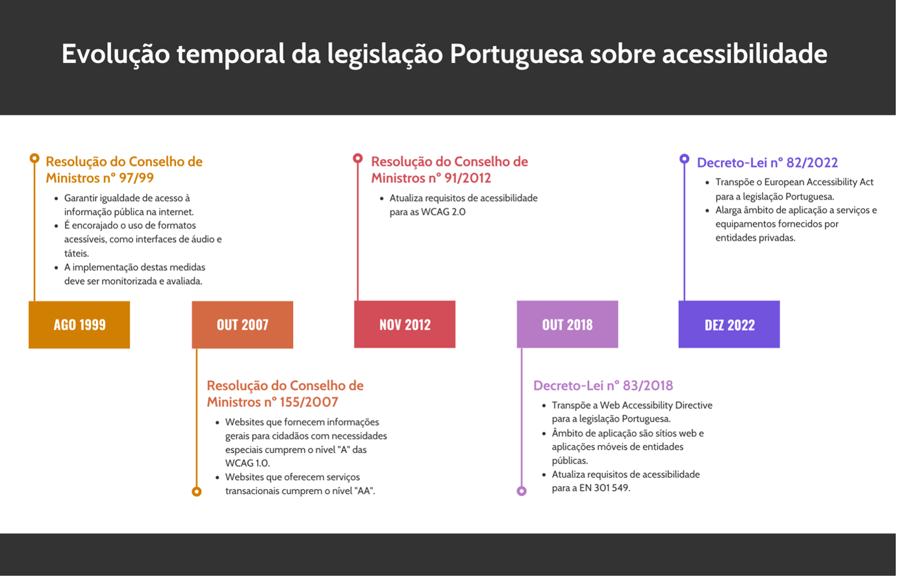

# Introdução à Legislação de Acessibilidade Digital em Portugal

A acessibilidade digital não é apenas uma questão de boa prática ou responsabilidade ética, mas também é um requisito legal. Em Portugal, a legislação que rege a acessibilidade digital está enraizada nos princípios de igualdade, não discriminação e design universal, visando garantir que todas as pessoas, independentemente das suas capacidades, possam aceder e usar conteúdos digitais.

A legislação portuguesa sobre acessibilidade digital é principalmente orientada por dois momentos chave:

1. Resolução do Conselho de Ministros nº 155/2007: Promulgada em 2 de outubro de 2007, exige a acessibilidade dos sítios da administração pública para pessoas com deficiência. Em particular, requer que os organismos do setor público garantam que os seus sítios são acessíveis a todos, seguindo as Diretrizes de Acessibilidade para Conteúdo Web (WCAG).
2. Decreto-Lei nº 83/2018: Promulgado em 19 de outubro de 2018, este decreto-lei transpõe a Diretiva (UE) 2016/2102 do Parlamento Europeu e do Conselho, sobre a acessibilidade dos sítios web e aplicações móveis dos organismos do setor público. Esta lei estende o âmbito da Lei nº 36/2011 para incluir aplicações móveis e requer que os organismos do setor público forneçam uma declaração de acessibilidade em que evidenciem o trabalho desenvolvido quer ao nível dos sítios web quer ao nível das aplicações móveis.

A legislação portuguesa alinha-se com a Norma Europeia EN 301 549, que estabelece os requisitos para a acessibilidade digital em toda a União Europeia. Esta norma inclui as diretrizes WCAG 2.1 e estende os requisitos a outros produtos e serviços de Tecnologias da Informação e Comunicação (TIC), não apenas sítios web e aplicações móveis.

É importante notar que estas leis se aplicam não apenas aos organismos do setor público, mas também às entidades privadas que prestam serviços públicos ou serviços de interesse geral. O não cumprimento pode resultar em penalidades, incluindo multas.

Mais recentemente, o Decreto-Lei n.º 82/2022 transpõe para a ordem jurídica portuguesa a Diretiva (UE) 2019/882 relativa aos requisitos de acessibilidade de produtos e serviços. Este decreto-lei estabelece as obrigações dos operadores económicos, incluindo fabricantes, importadores e distribuidores, de garantir que os seus produtos e serviços cumpram os requisitos de acessibilidade. O decreto-lei abrange uma vasta gama de produtos e serviços, como equipamentos informáticos, terminais de autoatendimento, serviços de comunicações eletrónicas, serviços bancários e de comércio eletrónico. No entanto, existem algumas exceções, como conteúdos multimédia pré-gravados e formatos de ficheiros de escritório publicados antes da entrada em vigor do decreto-lei.

Um aspeto importante a reter é que este decreto-lei visa harmonizar os requisitos de acessibilidade a nível europeu, de modo a facilitar o funcionamento do mercado interno e a inovação, em vez de os operadores económicos terem de lidar com a fragmentação da legislação. Adicionalmente, as entidades responsáveis pela fiscalização devem fornecer orientações às microempresas para facilitar a aplicação das medidas nacionais.

O objetivo final da legislação é criar um ambiente digital inclusivo onde todos, incluindo pessoas com deficiências, possam participar de forma plena e igual. Isso sublinha a importância de compreender e implementar os princípios da acessibilidade digital em todas as atividades de criação e gestão de conteúdo digital.

+++

# Introdução à Norma Europeia EN 301 549

A Norma Europeia EN 301 549 é um marco regulatório fundamental para a acessibilidade digital em toda a União Europeia. Promulgada em 2014 e atualizada em 2018, esta norma estabelece os requisitos de acessibilidade para os produtos e serviços de TIC.

A EN 301 549 abrange uma vasta gama de tecnologias, incluindo, mas não se limitando a, sítios web, aplicações móveis, software, documentos de escritório, e até mesmo sistemas operativos. O objetivo desta norma é garantir que todas as pessoas, incluindo aquelas com deficiências, possam usar efetivamente as tecnologias digitais.

Esta norma é dividida em várias seções, cada uma focada num tipo específico de produto ou serviço de TIC. Cada seção detalha os requisitos de acessibilidade específicos para esse produto ou serviço. Por exemplo, a seção 9 trata especificamente da acessibilidade de websites.

A EN 301 549 adota as Diretrizes de Acessibilidade para Conteúdo Web (WCAG) 2.1, que são referências globais amplamente reconhecidas para a acessibilidade do conteúdo web. A norma especifica que os sítios web e aplicações móveis devem cumprir com o Nível AA das WCAG 2.1.

É importante ressalvar que a EN 301 549 não é apenas uma recomendação, mas um requisito legal para os organismos do setor público na União Europeia, de acordo com a Diretiva (UE) 2016/2102. Isso significa que os sítios web e aplicações móveis do setor público devem cumprir com os requisitos de acessibilidade estabelecidos na norma.

Além disso, a EN 301 549 também se aplica a entidades privadas que fornecem serviços de interesse público ou geral, bem como a produtos e serviços de TIC que são adquiridos com fundos públicos.

Em resumo, a Norma Europeia EN 301 549 é uma ferramenta poderosa para garantir a inclusão digital e a igualdade de acesso às tecnologias digitais para todas as pessoas. A sua compreensão e aplicação são essenciais para a promoção da acessibilidade digital.

## Capítulos Relevantes da EN 301 549 para Acessibilidade de Websites e Aplicações Móveis

A Norma Europeia EN 301 549 é composta por vários capítulos, cada um focado num tipo específico de produto ou serviço de TIC. Para a acessibilidade de sítios web e aplicações móveis, os capítulos mais relevantes são o Capítulo 9 e o Capítulo 11.

**1. Capítulo 9 - “Web”**

Este capítulo é dedicado à acessibilidade de páginas eb. Ele adota as Diretrizes de Acessibilidade para Conteúdo Web (WCAG) 2.0 e 2.1 Nível AA como o padrão para a acessibilidade de sítios web. 

**2. Capítulo 11 - “Software”**

Este capítulo estabelece requisitos para software não-web, o que inclui aplicações móveis. A maioria das cláusulas apresentadas neste capítulo são adotadas das Diretrizes de Acessibilidade para Conteúdo Web. No entanto, há várias que adotam as propostas da força de trabalho do W3C que propôs uma formulação das WCAG adaptada para software genérico, não-web. 

Deve ainda destacar-se o capítulo “10 - Non-web documents” que define os requisitos para documentos não-web. Os requisitos deste capítulo aplicam-se a documentos que sejam disponibilizados em páginas web ou aplicações móveis, mas não embebidos nas páginas ou aplicações. Por exemplo, um documento em formato PDF ou DOCX que seja transferido de uma página web deve respeitar estes requisitos.

Estes capítulos garantem que o conteúdo digital nos seus diferentes formatos seja acessível a todos os utilizadores, independentemente das suas capacidades.

## Diferenças entre a norma europeia EN 301 549 e as Diretrizes de Acessibilidade para Conteúdo Web

As Diretrizes de Acessibilidade para Conteúdo Web (WCAG) e a EN 301 549 diferem no	 seu âmbito e aplicação, essencialmente nos tipos de conteúdo digital que cobrem e na sua jurisdição geográfica.

As WCAG, desenvolvidas pelo World Wide Web Consortium (W3C), são um conjunto de diretrizes que visam especificamente o conteúdo baseado na web. Fornecem um enquadramento detalhado para garantir que o conteúdo online, como sítios, aplicações web e mídia digital, seja acessível para pessoas com várias deficiências. Por exemplo, as WCAG recomendam fornecer alternativas de texto para conteúdo não textual, criar conteúdo que possa ser apresentado de maneiras diferentes sem perder informação e desenvolver conteúdo que seja mais fácil ver e ouvir para todos, incluindo pessoas com deficiências.

Em contraste, a EN 301 549 é uma norma europeia que vai além do conteúdo baseado na web. Abrange uma gama mais ampla de produtos e serviços digitais. Por exemplo, inclui requisitos específicos para software e hardware, como aplicações móveis e máquinas de emissão de bilhetes, bem como documentos não web, como PDFs e ficheiros Word. Isso significa que uma aplicação de software, um quiosque de informação pública ou um documento de escritório precisariam cumprir a EN 301 549, mas não necessariamente estar conformes com as WCAG, a menos que seja uma aplicação web ou tenha interfaces de utilizador baseadas na web.

Em termos de aplicação, as WCAG são uma norma reconhecida globalmente e são frequentemente referenciadas em leis e políticas em todo o mundo para garantir a acessibilidade da web. No entanto, não são juridicamente vinculativas. Por outro lado, a EN 301 549 é juridicamente vinculativa nos países europeus, o que significa que os produtos e serviços digitais nestes países devem cumprir esta norma para garantir a acessibilidade.

+++

# Compreendendo os Conceitos de Acessibilidade: Percetível, Operável, Compreensível e Robusto

Estes quatro conceitos formam a base das Diretrizes de Acessibilidade para Conteúdo Web (WCAG) e são essenciais para criar um ambiente digital verdadeiramente inclusivo.

1. Percetível: Refere-se à capacidade de os utilizadores perceberem a informação apresentada, independentemente das suas capacidades sensoriais. Por exemplo, o conteúdo visual deve ser acompanhado por descrições alternativas de texto para pessoas que não podem ver, e o conteúdo auditivo deve ser acompanhado por legendas para pessoas que não podem ouvir.
2. Operável: Significa que todas as funcionalidades do site ou aplicação devem ser operáveis através de uma variedade de entradas, não apenas através do uso do rato. Por exemplo, um utilizador deve ser capaz de navegar num site usando apenas o teclado ou uma tecnologia de apoio, como um leitor de ecrã.
3. Compreensível: Refere-se à capacidade de os utilizadores compreenderem tanto o conteúdo quanto a operação do sítio ou aplicação. Isso inclui o uso de linguagem clara e simples, a consistência na navegação e a identificação clara dos erros.
4. Robusto: Significa que o conteúdo deve ser suficientemente robusto para ser interpretado de maneira fiável por uma ampla variedade de tecnologias de apoio. Isso inclui a conformidade com os padrões de codificação e a garantia de que o sítio ou aplicação continua a funcionar mesmo quando as tecnologias de apoio e os navegadores são atualizados.

Cada um destes princípios é crucial para garantir que todas as pessoas, independentemente das suas capacidades, possam aceder e usar a informação e os serviços digitais. Ao projetar e desenvolver um sítio ou aplicação, é importante considerar cada um destes princípios para garantir a máxima acessibilidade.

+++

# Aplicação dos Conceitos de Acessibilidade

A aplicação efetiva dos conceitos de acessibilidade é essencial para garantir que o conteúdo digital seja acessível a todos os utilizadores, independentemente das suas capacidades. Aqui estão alguns exemplos de como esses conceitos podem ser aplicados na prática:

1. Percetível: Uma maneira de tornar o conteúdo visual percetível para pessoas que não podem ver é fornecer descrições alternativas em texto para todas as imagens, gráficos e vídeos. Por exemplo, uma imagem de um cão a brincar no parque poderia ter uma descrição em texto alternativa como "Um cão alegre a correr num parque ensolarado". Da mesma forma, para tornar o conteúdo auditivo percetível para pessoas que não podem ouvir, as legendas devem ser fornecidas para todos os vídeos com som. Por exemplo, um vídeo de uma palestra deve ter legendas que transcrevam exatamente o que o orador está a dizer.
2. Operável: Para garantir que um sítio ou aplicação seja operável para todos os utilizadores, é importante que todas as funcionalidades possam ser acedidas e operadas de várias maneiras. Por exemplo, os utilizadores devem ser capazes de navegar num sítio usando apenas o teclado, sem a necessidade de um rato. Além disso, os botões e ligações devem ser suficientemente grandes e espaçados para que possam ser facilmente selecionados por utilizadores com coordenação motora limitada.
3. Compreensível: Para tornar um sítio ou aplicação compreensível, é importante usar linguagem clara e simples e garantir que a navegação seja consistente em todas as páginas. Por exemplo, o menu de navegação deve aparecer no mesmo local em todas as páginas e as ligações devem ser claramente rotuladas para indicarem para onde levam. Além disso, quando os utilizadores inserem informações, como ao preencher um formulário, devem ser fornecidas indicações e mensagens de erro claras para ajudar os utilizadores a evitar e corrigir erros.
4. Robusta: Para garantir a robustez de um sítio ou aplicação, é importante seguir os padrões de codificação e testar o sítio ou aplicação em uma variedade de tecnologias de apoio e navegadores. Por exemplo, o sítio deve ser codificado usando HTML válido e semântico, e deve ser testado em vários leitores de ecrã e navegadores para garantir que funciona corretamente em todos eles.

Ao aplicar estes conceitos de acessibilidade, é importante lembrar que a acessibilidade beneficia todos os utilizadores, não apenas aqueles com deficiências. Um site ou aplicação que é percetível, operável, compreensível e robusto será mais fácil de usar e mais agradável para todos os utilizadores.

+++

# Estrutura das Diretrizes de Acessibilidade para Conteúdo Web (WCAG)

As Diretrizes de Acessibilidade para Conteúdo Web (WCAG) são um conjunto de recomendações desenvolvidas pelo World Wide Web Consortium (W3C) com o objetivo de tornar o conteúdo web mais acessível a pessoas com deficiências.

A estrutura das WCAG é organizada em torno de quatro princípios fundamentais, que já mencionámos anteriormente: Percetível, Operável, Compreensível e Robusto. Cada princípio é detalhado através de um conjunto de diretrizes, que fornecem metas gerais a serem alcançadas. Por exemplo, uma diretriz sob o princípio "Percetível" é "Fornecer alternativas textuais para todo o conteúdo não textual".

Cada diretriz é apoiada por critérios de sucesso, que são declarações testáveis que descrevem condições específicas que o conteúdo deve cumprir para ser considerado acessível sob essa diretriz. Por exemplo, um critério de sucesso para a diretriz mencionada acima é "1.1.1 Conteúdo Não Textual: Todo o conteúdo não textual apresentado ao utilizador tem uma alternativa textual que serve o mesmo propósito".

Os critérios de sucesso são classificados em três níveis de conformidade, cada um refletindo o grau de acessibilidade, que serão apresentados na próxima secção.

As WCAG também incluem técnicas suficientes e técnicas recomendadas para cada critério de sucesso. As técnicas suficientes são formas específicas de cumprir os critérios de sucesso, enquanto as técnicas recomendadas são sugestões que podem melhorar a acessibilidade, mas não são obrigatórias.

A partir da versão 2.2 das WCAG, estas passaram a incluir também regras ACT (Accessibility Conformance Testing). A integração das regras ACT fornece diretrizes claras e específicas para avaliar e testar a conformidade dos conteúdos web com os padrões de acessibilidade. Essas regras complementam as técnicas existentes, oferecendo um conjunto abrangente de critérios de teste que ajudam a assegurar que os sítios web e aplicações sejam acessíveis a todos os utilizadores, incluindo aqueles com deficiências. A inclusão das regras ACT nas WCAG fortalece a abordagem holística da acessibilidade digital, promovendo a criação de conteúdos mais inclusivos e acessíveis para uma ampla gama de públicos.

Em resumo, a estrutura das WCAG é projetada para fornecer uma abordagem abrangente e flexível para a acessibilidade do conteúdo web, permitindo que os desenvolvedores escolham as soluções que melhor se adaptam às suas necessidades e contextos específicos.

+++

# Compreendendo os Níveis de Conformidade das WCAG

Os Níveis de Conformidade das Diretrizes de Acessibilidade para Conteúdo Web (WCAG) são uma parte essencial da estrutura das WCAG. Eles fornecem uma maneira de medir a acessibilidade de um sítio ou aplicação e estabelecer metas para melhorias. Existem três níveis de conformidade: A, AA e AAA.

1. Nível A: Este é o nível mais básico de acessibilidade. Cumprir este nível significa que o sítio ou aplicação atende aos requisitos mínimos de acessibilidade. No entanto, isso não significa que o sítio ou aplicação seja totalmente acessível a todos os utilizadores. Por exemplo, um sítio que cumpre o Nível A pode ter texto alternativo para todas as imagens, mas ainda pode ter problemas de contraste de cor que dificultam a leitura para pessoas com deficiência visual.
2. Nível AA: Este nível aborda os problemas mais significativos de acessibilidade e é, muitas vezes, visto como um bom equilíbrio entre acessibilidade e esforço de implementação. Um sítio ou aplicação que cumpre o Nível AA é geralmente acessível para a maioria dos utilizadores. Por exemplo, um sítio que cumpre o Nível AA deve ter um contraste de cor suficiente para que o texto seja facilmente legível, além de ter texto alternativo para todas as imagens.
3. Nível AAA: Este é o nível mais alto de acessibilidade e requer que o sítio ou aplicação cumpra os critérios de acessibilidade mais rigorosos. No entanto, pode não ser possível para todos os sítios ou aplicações cumprir todos os critérios do Nível AAA. Por exemplo, um sítio que cumpre o Nível AAA pode ter funcionalidades adicionais, como a capacidade de alterar o espaçamento entre linhas e parágrafos para melhorar a legibilidade.

Para ilustrar como esses níveis de conformidade funcionam na prática, consideremos o seguinte caso:

Suponha que temos um sítio de notícias. Se este sítio cumprir o Nível A, terá funcionalidades básicas de acessibilidade, como texto alternativo para imagens e cabeçalhos adequados para estruturar o conteúdo. No entanto, pode ter problemas como contraste de cor insuficiente entre o texto e o fundo, tornando o texto difícil de ler para pessoas com deficiência visual.

Se o mesmo sítio cumprir o Nível AA, terá contraste de cor suficiente, além de outras funcionalidades como a capacidade de redimensionar o texto sem perder funcionalidades. Isso tornará o sítio mais acessível para um leque mais amplo de utilizadores.

Finalmente, se o sítio cumprir o Nível AAA, terá funcionalidades ainda mais avançadas, como a capacidade de alterar o espaçamento entre linhas e parágrafos. No entanto, implementar todas as funcionalidades do Nível AAA pode ser um desafio para muitos sítios.

Em resumo, os níveis de conformidade das WCAG fornecem um quadro útil para avaliar e melhorar a acessibilidade de um sítio ou aplicação. No entanto, é importante lembrar que a conformidade com as WCAG é apenas uma parte da criação de um sítio ou aplicação verdadeiramente acessível. A acessibilidade deve ser considerada em todas as fases do design e desenvolvimento, e deve incluir a participação e o feedback dos utilizadores com deficiências.

